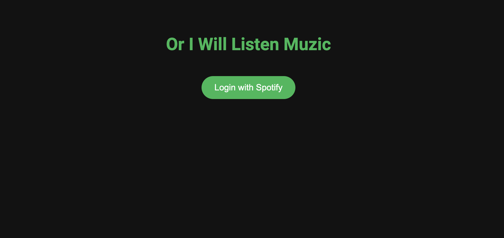
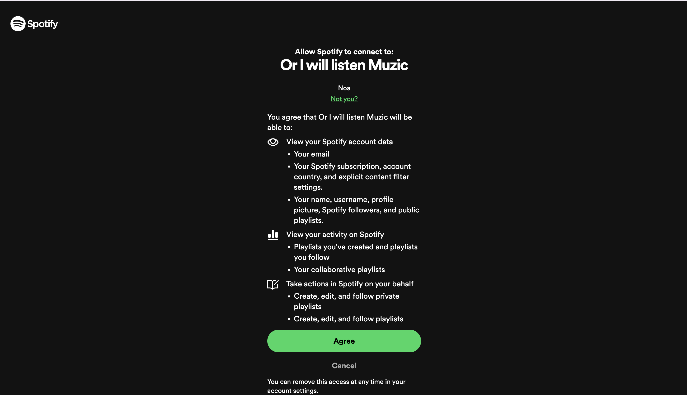

# Or I Will Listen Muzic

**Or I Will Listen Muzic** is a web application designed to help individuals manage job rejection experiences by logging their moods and receiving personalized song suggestions from Spotify. Over time, users can build a playlist that reflects their emotional journey, providing both solace and motivation.

**Do you know? Muzic sounds similar to 'Unemployment' in Korean**

## Screenshots




## Features

- **Spotify Authentication:** Securely log in with your Spotify account.
- **Log Rejections:** Record job rejections and select your current mood.
- **Personalized Song Suggestions:** Receive song recommendations based on your mood.
- **View Playlists:** Browse and access your Spotify playlists.
- **Add Songs to Playlists:** Save suggested songs directly to your Spotify playlists.
- **Responsive and Modern Design:** Enjoy a sleek and engaging user interface.
- **Token Refresh Mechanism:** Maintain user sessions without requiring frequent logins.

## Technologies Used

- **Frontend:** HTML, CSS (Flexbox), JavaScript
- **Backend:** Node.js, Express
- **API Integration:** Spotify Web API
- **Version Control:** Git & GitHub
- **Styling:** Google Fonts (Roboto), CSS Flexbox

## Prerequisites

Before you begin, ensure you have met the following requirements:

- **Node.js & npm:** Ensure you have Node.js and npm installed. [Download Here](https://nodejs.org/)
- **Git:** Ensure Git is installed. [Download Here](https://git-scm.com/downloads)
- **Spotify Developer Account:** Sign up at [Spotify Developer Dashboard](https://developer.spotify.com/dashboard/) and create a new application to obtain your `Client ID` and `Client Secret`.
- **Live Server:** Install globally for serving the frontend.

  ```
  npm install -g live-server
  ```

## Setup Instructions

1. Clone the repository:

  ```
  git clone https://github.com/AnChangSal/or-i-will-listen-muzic.git
  cd or-i-will-listen-muzic
  ```

2. Set up the Backend:

  ```
  cd backend
  npm install
  ```

  ```
  cp .env.example .env
  ```

  ```
  npm run dev
  ```

3. Set up the Frontend:

  ```
  cd frontend
  ```

  ```
  live-server --port=5500
  ```

4. Log in with your Spotify account and start using the application!

## License

This project is licensed under the MIT License.
